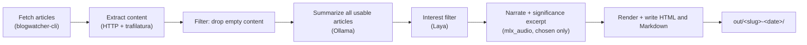

## Context
---
Keeping up with the industry frontier and news is essentially a full-time job at this point. Social media are helpful to an extent, but I definitely miss out on big releases by not keeping up with the sources directly. The startup world especially, you need to be reading from the blogs directly rather than hoping to come across the articles through a different platform. Cutting through the noise of social media and the blog feeds is tiring, sometimes depressing, and always distracting.

That's why I built this automation. Every day, it pulls articles from sources that I've set and chooses ones that align well with my interests and goals, then prepares them into a couple output formats. It's an agentic workflow, making use of LLMs, and uses only local models.

Disclaimer: sometimes social media *is* where you want to check in the first place; Twitter is probably the most important one for being as close as possible to things that are happening in the industry. LinkedIn is a close second.

## Design
---
The workflow depends on having chosen a set of sources; I had a conversation with Claude to find and organize sources that I wanted to read through, e.g. [a16z Speedrun](https://speedrun.substack.com/) and [YC News](https://news.ycombinator.com/). All blogs get loaded into [blogwatcher-cli](https://github.com/JulienTant/blogwatcher-cli) for managing blogs and pulling articles.

I chose `blogwatcher-cli` because the original version of this workflow was running as a Hermes cron job, and [Hermes comes pre-loaded with an optional skill for the tool](https://hermes-agent.nousresearch.com/docs/user-guide/skills/optional/research/research-blogwatcher).

The workflow looks like this:

Articles from today are fetched from `blogwatcher-cli` and their content extracted, with empty articles (for whatever reason) being dropped. Generally, if an article can be pulled through `blogwatcher-cli`, it can be pulled for content summarization.

The articles are summarized and have 5 keywords generated for them. I use `qwen3.5:9b` with modified parameters, which is running on a machine on my LAN, and that hosts all of my local models.

The summary and keywords are sent to a decision model along with the content of the article and metadata like the source, title, and author.

Decision models like Jev have been all the rage the past month, but I'm glad that even those have a local version I can run: [Laya](https://huggingface.co/convaiinnovations/laya). Laya is an open-weight decision model that's lightweight enough to run completely on my CPU and runs fast for the volume I have. It acts as a gate to which articles are actually displayed to me: based on the given data (summary, keywords, article content, metadata) and my interests/goals, it determines whether an article actually aligns with what I want to read.

Articles that successfully pass through the gate are articles that I should read. However, being Gen Z, obviously I'm functionally illiterate and can't read, my short attention span won't let me (can someone make an anthropomorphic AI fruit video about this article?). In order to ease the pain of having to read words, I run each passing article through a local TTS model [Qwen3 TTS with VoiceDesign](https://huggingface.co/mlx-community/Qwen3-TTS-12Hz-1.7B-VoiceDesign-bf16), which is actually being run on my MacBook instead of the local machine I have on my network. The audio outputs are created in chunks, split on paragraphs, and stitched back together with `ffmpeg`. That output audio is then included in the HTML output of the article workflow.

Once the HTML and Markdown files are prepared, the files are saved to my "Artifact Viewer", a tool I made for viewing and collecting artifacts from my conversations. I can open up today's output and listen to all the articles that were chosen for me.
